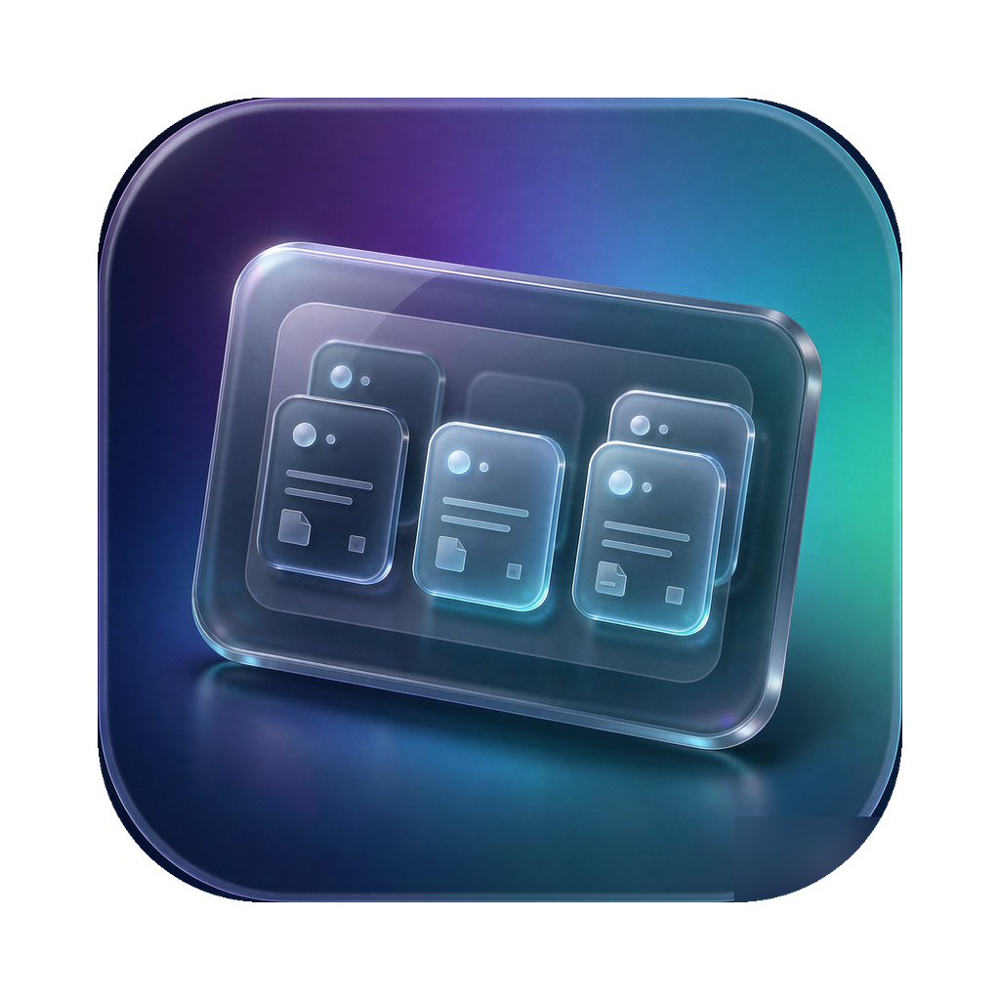

<div align="center">



# 桌面托盘 Desktop Tray

macOS 桌面玻璃托盘文件管理器 —— 把散乱的桌面文件收进好看的托盘里。

`Swift` `AppKit` `单文件源码` `原生 macOS 13+`

</div>

## 这是什么

桌面上文件堆成山？「桌面托盘」在桌面上放几块半透明玻璃托盘，把文件拖进去就收拢了，文件**真实保存在磁盘上**（不是数据库，不是魔法），随时能在 Finder 里找到。

## 功能

- 🗂 **拖入即收**：从桌面 / Finder 把文件拖进托盘，图标原位收拢；拖回桌面一键还原
- ⌘ **空格预览**：选中文件夹按空格，弹出缩略图网格预览，可直接把缩略图拖出去移动文件
- 📁 **文件夹归组**：托盘内可建文件夹，拖文件到文件夹图标即归档
- 🧲 **窗口跟随系统**：跨托盘拖拽、多选、置顶、重命名、复制副本、废纸篓，全套 Finder 习惯操作
- 🛡 **健壮性**：文件操作全部后台执行不卡 UI；崩溃自动重启守护（每日上限）；状态损坏自动从备份恢复；任何失败都明确提示、绝不静默吞文件
- 🎨 **原生玻璃 UI**：系统级玻璃材质、磨砂弹窗、Toast 提示，跟随系统外观

## 安装

从 [Releases](../../releases) 下载 `桌面托盘-vX.X.X.dmg`，双击运行即可。

> 应用为 ad-hoc 签名，首次打开若被 Gatekeeper 拦截：右键 App →「打开」，或在 系统设置 → 隐私与安全性 中放行。

## 自己编译

零依赖，只要 Xcode Command Line Tools：

```bash
swiftc -O -o TrayApp TrayApp.swift -framework Cocoa -framework Quartz
```

## 项目结构

整个应用就是 **一个 Swift 文件**（约 5300 行）：`TrayApp.swift`。窗口、拖拽、预览、文件监控、崩溃守护全在里面，适合当 AppKit 单文件应用的参考实现来读。

## License

[MIT](LICENSE)
